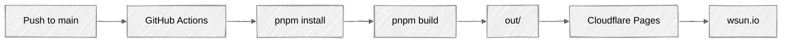

# Personal Website

Personal website and blog: **[wsun.io](https://wsun.io)**

Built with Next.js 15 (static export), React 18, TypeScript, Tailwind CSS 3.4, shadcn/ui, Framer Motion 11, and MDX. Blog comments powered by Giscus. Auto-deployed to Cloudflare Pages via GitHub Actions.

## Quickstart

Prerequisites: **Node.js >= 18 LTS** and **pnpm >= 10**.

```bash
git clone git@github.com:WilliamOdinson/williamodinson.github.io.git
cd williamodinson.github.io
pnpm install
pnpm dev
```

Open [http://localhost:3000](http://localhost:3000).

Other commands:

```bash
pnpm lint         # ESLint (strict TypeScript + Next.js rules)
pnpm lint:fix     # Auto-fix lint errors
pnpm build        # Production build, static export to out/
```

## Deployment

Pushing to `main` triggers `.github/workflows/deploy.yaml`, which runs `pnpm install` then `pnpm build` and deploys the `out/` directory to Cloudflare Pages.



To preview a production build locally:

```bash
pnpm build
npx serve out
```

## Content Quick Start

All content is MDX. Create a folder + `page.mdx` and it's live on next build.

**New blog post:** `src/app/blog/<slug>/page.mdx`

```mdx
---
title: "Post Title"
summary: "One-line description."
date: 2025-08-01
tags: ["Go", "Cloud"]
featured: true
---

Your markdown content here.
```

Set `featured: true` to show on the homepage.
