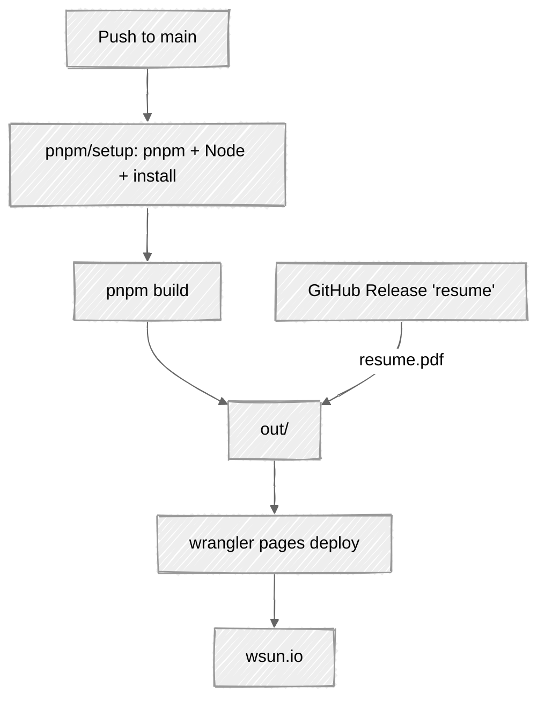

# Personal Website

Personal website and blog, live at **[wsun.io](https://wsun.io)**.

Next.js (App Router, static export), React, TypeScript, Tailwind CSS, shadcn/ui, Framer Motion, and MDX. Posts are MDX files; front matter drives page metadata, Open Graph, JSON-LD, the RSS feed, and the sitemap through two small remark plugins. Comments via Giscus, page views via GoatCounter. Deployed to Cloudflare Pages by GitHub Actions.

## Quickstart

Prerequisites: **Node.js >= 20.9** and **pnpm 12**.

```bash
git clone git@github.com:WilliamOdinson/williamodinson.github.io.git wsun.io
cd wsun.io
pnpm install
pnpm dev
```

Open [http://localhost:3000](http://localhost:3000).

|     Command      |                What it does                |
| :--------------: | :----------------------------------------: |
|    `pnpm dev`    |  Dev server with Turbopack and hot reload  |
|   `pnpm build`   |   Type-check and static export to `out/`   |
|   `pnpm lint`    | ESLint (strict TypeScript + Next.js rules) |
| `pnpm lint:fix`  |            Same, with auto-fix             |
|   `pnpm clean`   |         Remove `.next/` and `out/`         |
| `pnpm clean:all` | Also remove `node_modules/` and reinstall  |

To preview the production build the way Cloudflare serves it:

```bash
pnpm build
npx serve out
```

## Writing a post

Create `src/app/blog/<slug>/page.mdx`. The folder name is the URL. It is picked up on the next build; nothing else to register.

```markdown
---
title: "Post Title"
summary: "One sentence shown in lists, the feed, and as the meta description."
date: 2025-08-01
tags: ["Go", "Cloud"]
featured: true
---

# Post Title

Your content here.
```

| Field      | Required | Notes                                                                                              |
| ---------- | -------- | -------------------------------------------------------------------------------------------------- |
| `title`    | yes      | `<title>` and Open Graph title. The visible heading is not generated; write `# Title` in the body. |
| `summary`  | yes      | Meta description, list excerpt, RSS description, JSON-LD description.                              |
| `date`     | yes      | `YYYY-MM-DD`. Parsed as UTC; lists sort by it, newest first.                                       |
| `featured` | no       | `true` shows the post in the homepage "Blog Posts" section. Default `false`.                       |
| `tags`     | no       | Meta keywords and Open Graph tags.                                                                 |
| `cover`    | no       | Open Graph image, a path under `public/` (e.g. `/images/my-post/cover.png`) or a full URL.         |

What the front matter generates, per post: `export const metadata` (title, description, keywords, canonical URL, Open Graph, Twitter card) from `src/lib/remark-next-metadata.mjs`, and a `BlogPosting` JSON-LD block from `src/lib/remark-json-ld.mjs`. Both plugins are registered in `next.config.js` and read `src/lib/site.config.mjs` for author and site fields.

Available inside MDX (registered in `mdx-components.tsx`):

- Fenced code blocks render with syntax highlighting and a copy button.
- `` <Mermaid chart={`graph LR; A --> B`} /> `` renders a diagram that follows the site theme.
- Images use `` with files under `public/`; they open in a lightbox on click.

Every post page also gets a view counter and a Giscus comment thread; both are wired in `src/app/blog/blog-layout-inner.tsx` and need no per-post setup.

Generated at build time from the same front matter: `/feed.xml` (RSS 2.0) and `/sitemap.xml`.

## Configuration

| Where                                | What                                                                                                                                                                                   |
| ------------------------------------ | -------------------------------------------------------------------------------------------------------------------------------------------------------------------------------------- |
| `src/lib/site.config.mjs`            | Single source of truth: author (name, email, social links, education), site URL and title, RSS strings, GoatCounter site code. Imported by React components and by the remark plugins. |
| `src/components/giscus-comments.tsx` | Giscus `repo`, `repo-id`, `category`, `category-id`. Get values from [giscus.app](https://giscus.app).                                                                                 |
| `src/sections/*.tsx`                 | Homepage copy: hero, about, blog list.                                                                                                                                                 |
| `next.config.js`                     | MDX plugin chain, static export, `allowedDevOrigins` for testing the dev server from another device on the LAN.                                                                        |
| `public/`                            | Static files served as-is: portrait, animoji, `humans.txt`, `robots.txt`.                                                                                                              |

`robots.txt` intentionally stays minimal. Cloudflare's managed robots.txt prepends its Content Signals block to the origin file at the edge; the repo file contributes the `Sitemap:` line, which the managed block does not add.

## Deployment

Two workflows in `.github/workflows/`:

- `ci.yaml` runs on pull requests: `pnpm lint` and `pnpm build`.
- `deploy.yaml` runs on every push to `main` (and manually via `workflow_dispatch`): build, inject the resume, deploy `out/` to the Cloudflare Pages project `williamodinson`. Deploys are serialized; a new push waits for the running deploy instead of cancelling it.


```mermaid
%%{init: {'look': 'handDrawn', 'theme': 'neutral'}}%%
graph TD
    A[Push to main] --> B[pnpm/setup: pnpm + Node + install]
    B --> C[pnpm build]
    C --> D[out/]
    R[GitHub Release 'resume'] -->|resume.pdf| D
    D --> E[wrangler pages deploy]
    E --> F[wsun.io]
```
